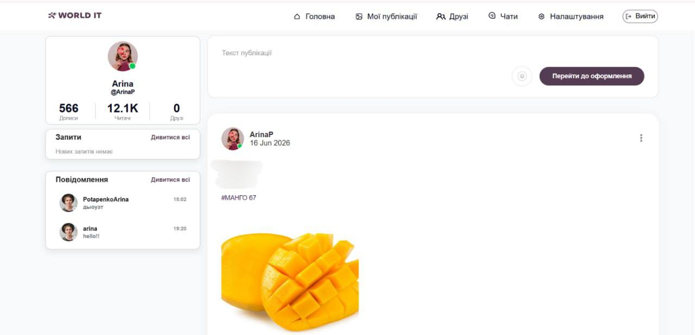
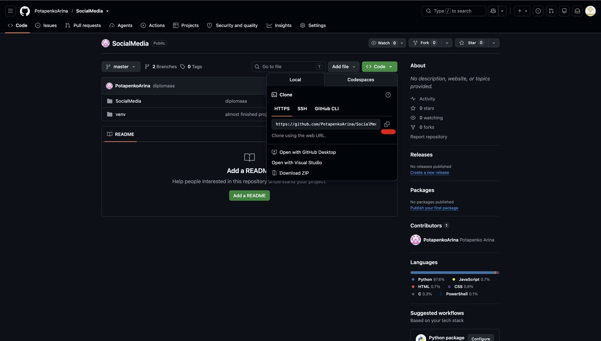
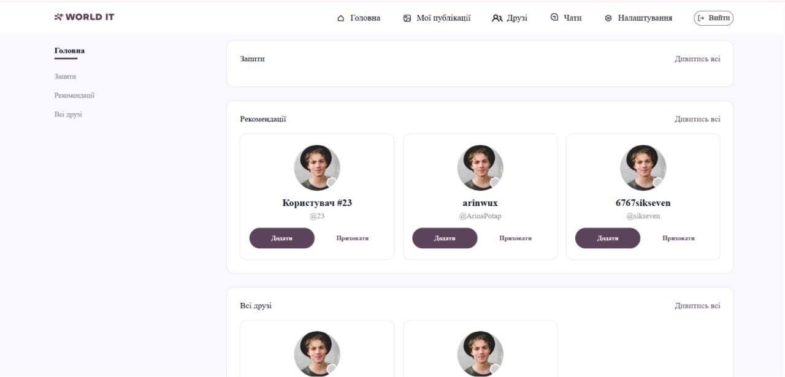
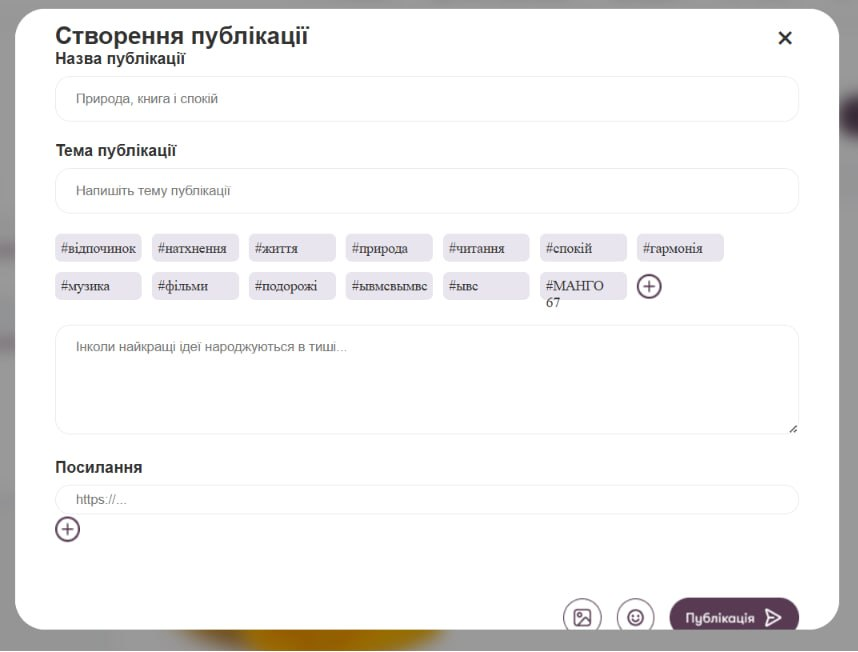
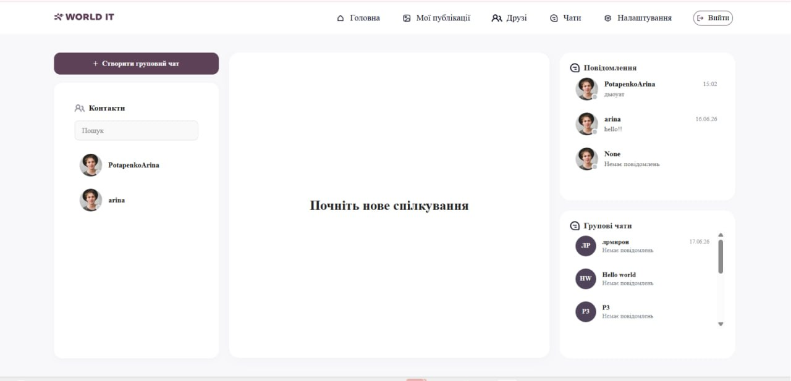

# SOCIAL MEDIA


<details>
<summary>
English version
</summary>
<p></p>
<i>


**SocialMedia** - is a social network built on the **Django** web framework, designed for posting and exchanging messages at any time.



---

## Navigation

- [Purpose](#purpose)
- [Team Members](#team_members)
- [List of Modules and Technologies](#list_of_modules_and_technologies)
- [How to Launch the Project](#how_to_launch_the_project)
- [Project Contents](#project_contents)
- [Conclusion](#conclusion)

---

## Purpose

*The main purpose of the **SocialMedia** social network is to make it **simple, fast,** and **convenient** to post on your profile and allow other users to learn more about you and your life. View content from your favorite authors and follow their pages; like or repost their posts to let others see things worth paying attention to as well. Exchange messages with your friends, family, or colleagues. You can create a group with several family members and send messages to every member at once.*

---

## Team Members 

#### Oryna Potapenko (`TEAMLEAD`)

- **Role:** Team Lead, Developer
- **GitHub:** [Go to](https://github.com/PotapenkoArina)

#### Polina Hovorukha

- **Role:** Developer, Front-end
- **GitHub:** [Go to](https://github.com/HovorukhaPolina)

#### Sofia Didorenko

- **Role:** Developer, Front-end
- **GitHub:** [Go to](https://github.com/SofiiaDidorenko)


#### Angelina Odintsova

- **Role:** Programmer, Front-end
- **GitHub:** [Go to](https://github.com/OdintsovaAngelina)

---

## List of Modules and Technologies

- **Django** - The main framework, using the MTV architecture.
- **Django Channels, Daphne** - Help create an asynchronous server for long-running connections and for creating groups and private chats.
- **Django ORM** - Used for working with the database. It also uses **Subquery, OuterRef, Count**, etc.
- **Django Authentication System** - Used for user authentication.

> On the front end, we used only JavaScript, HTML (Django Templates), and CSS.

- **Paginator** - Used for paginated message history.
- **IntersectionObserver API** — Also helps load older messages on the front end.
- **WebSocket Protocol** — The protocol we use for real-time messaging. It uses two channels: **ChatConsumer** and **Asynchronous AJAX Fetch API**.
- **X-CSRFToken** - We use this for security; every HTTP request checks the security token to verify that we are the ones sending the request, not some fraudsters.
- **Cloudinary** - We use this for project deployment, specifically to store our media files on this server.

---

## How to Run the Project

1. Get the link to the repository and copy it



2. Open a terminal and clone the repository

```sh
git clone https://github.com/PotapenkoArina/SocialMedia.git
```

3. Select your operating system and follow all the steps listed below.

<details>
<summary>
Windows
</summary>
<p></p>


1. Create a virtual environment;
   ```bash
   python -m venv venv
   ````

2. Activate the environment;

   ```bash
   .\venv\Scripts\activate
   ```

3. Install dependencies.
   ```bash
   pip install -r requirements.txt
   ````

</details>

<details>
<summary>
macOS
</summary>
<p></p>

1. Create a virtual environment;

   ```bash
   python3 -m venv venv
   ```

2. Activate the environment;
   ```bash
   source venv/bin/activate
   ````

1. Install dependencies.

   ```bash
   pip3 install -r requirements.txt
   ```

</details>
<p></p>

---

## Project Overview

*This section lists all the applications featured on our social network and explains the role each one plays in the project.*


<details>
<summary>
<b> User_app </b>
</summary>

<p></p>

*A friends app that displays friend requests from other users, recommendations for people you might know, and all the friends you’ve interacted with. In the recommendations, you can either add other users as friends or hide them so they don’t appear in your recommendations. The same applies to friend requests.*



In this app, we’ve created 4 pages related to **friends.**
- **Friends_main** - The main page, where you’ll see all your friends at once on a single page.
- **Requests** - The requests page, where you’ll see all users who have added you or invited you to be friends.
- **Recommendations** - A page showing all users who are likely to be your acquaintances, or with whom your friends have recently interacted.
- **All_Friends** - A page displaying all the friends you've added. You can start chatting with them or create a group.

<p></p>
</details>

<details>
<summary>
<b> Home_app </b>
</summary>

<p></p>

*The home page, which displays your profile, friend requests, and messages from your friends or other users. Most importantly, it displays posts recently published by your friends or favorite authors. You can like or repost other users’ posts so your friends can also see and pay attention to things worth noting.*


In this app, we’ve created a single main page where you can conveniently view **posts** and your **profile** at a glance.
From this page, you can quickly and easily switch to any other page to do whatever you need. You can also quickly go to the post editor by simply clicking the “Go to Editor” button.

<p></p>
</details>


<details>
<summary>
<b> Post_app </b>
</summary>

<p></p>

*An app for posts that lets you create a post quickly and easily, enter a title, topic, and link.*




In this app, we’ve created a single main page that displays **all the posts** from your friends, and most importantly, lets you create your own post with your own design. Give your post a title, choose a theme, add plenty of hashtags so other users can find your post, write a description, and share your thoughts on important topics or simply tell a story about your life. Add as many photos or videos as you think are important, and include a link if necessary. Publish the post and enjoy the likes and reposts from other users—and keep them intrigued.

<p></p>
</details>


<details>
<summary>
<b> Chat_app </b>
</summary>

<p></p>

*An app where you can find all the chats and groups you’ve joined recently. Exchange messages with other users in real time, quickly and without delays.*



In this app, we’ve created a single main page that displays all your **private chats** with friends, colleagues, or family members, as well as business chats and more. You can create a group to add a certain number of people, where you can discuss topics that are important to you. Everything is very safe and secure, so you don’t even have to worry about scammers or other users seeing your conversations.

<p></p>
</details>

---

## Conclusion


*Our team is very grateful, first and foremost, to Mykola and Bohdan—they are the ones who spent the past year teaching us how to get every little detail of our project right so that it would turn out exactly as you see it now. While working on this project, we learned a great deal—including many new modules and technologies that will help us build our own website network that runs without bugs. And if any do pop up, we’ll fix them and learn from our mistakes. We also learned what it’s like to work as a team, where the team lead assigns tasks to each member and helps anyone who doesn’t understand how to complete a task, just as the other team members do. Throughout the entire thesis project, we helped each other and solved errors and problems together. Our entire team believes that this project turned out quite well and that it can be continued and promoted in the future—by creating a better version of it and, perhaps, growing its user base to match that of popular social networks. We believe this project will be a great addition to our GitHub portfolio, and we are very grateful to our mentors for this!
Sincerely, Oryna Potapenko’s team.*

</details>
<p></p>

**SocialMedia** - це соціальна мережа, створена на основі веб-фреймворку **Django**, призначена для публікації постів та обміна повідомленнями у будь який час.


---

## Навігація

- [Мета створення](#мета_створення)
- [Склад команди](#склад_команди)
- [Перелік модулей та технологій](#перелік_модулей_та_технологій)
- [Як запустити проєкт](#як_запустити_проєкт)
- [Зміст проєкту](#зміст_проєкту)
- [Висновок](#висновок)

---

## Мета створення

*Головна мета соціальної мережи **SocialMedia** - **просто, швидко,** та **зручно** додавати пости на свій профіль та надати можливість іншим користувачам побачити більше про вас та ваше життя. Дивіться контент ваших улюблених авторів та слідкуйте за їх сторінкою, ставте вподобайки або репостіть їх пости щоб надати можливість іншим також бачити варті уваги речі. Обмінюйтеся повідомленнями зі своїми друзями, родичами або колегами. Ви можете створити групу з кількома користувачами своєї родини та надсилати повідомлення одразу кожному учаснику.*

---

## Склад команди 

#### Потапенко Орина (`TEAMLEAD`)

- **Роль:** Тімлід, програміст
- **GitHub:** [Перейти](https://github.com/PotapenkoArina)

#### Говоруха Поліна

- **Роль:** Програміст, верстка
- **GitHub:** [Перейти](https://github.com/HovorukhaPolina)

#### Дідоренко Софія

- **Роль:** Програміст, верстка
- **GitHub:** [Перейти](https://github.com/SofiiaDidorenko)

#### Одинцова Ангеліна

- **Роль:** Програміст, верстка
- **GitHub:** [Перейти](https://github.com/OdintsovaAngelina)

---

## Перелік модулей та технологій

- **Django** - Головний фрейморк, використовує архітектуру MTV.
- **Django Channels , Daphne** - Допомагають створити асінхронний сервер для тривалих зʼєднань та для створення груп і приватних чатів.
- **Django ORM** - Використовуємо для роботи з базою даних. Також використовує **Subquery, OuterRef, Count** тощо.
- **Django Authentication System** - Використовуємо для авторизації користувачів.

> На фронтенді використовували лише JavaScript, HTML(Django Templates) та CSS.

- **Paginator** - Використовуємо для історії повідомлень з пагінацією.
- **IntersectionObserver API** - Також допомагає підвантажувати старі повідомлення але на фронтенді.
- **WebSocket Protocol** - Протокол який використовуємо для миттєвого обміну повідомленнями. Він використовує два канали **ChatConsumer** та **Asynchronous AJAX Fetch API**.
- **X-CSRFToken** - Використовуємо для захисту, кожен HTTP запит переіряє токен безпеки та перевіряє чи справді ми надсилаємо запит, а не якісь шахраї.
- **Cloudinary** - Використовуємо для деплою проєкту, а саме для того щоб хранити на цьому сервері наші медіа файли.

---

## Як запустити проєкт

1. Отримати посилання на репозиторій та скопіювати


2. Перейти до терміналу та склонувати репозиторій

```sh
git clone https://github.com/PotapenkoArina/SocialMedia.git
```

3. Оберіть свою ОС та слідкуйте усім переліченим пунктам.

<details>
<summary>
Windows
</summary>
<p></p>


1. Створити віртуальне оточення;
   ```bash
   python -m venv venv
   ````

2. Активувати оточення;

   ```bash
   .\venv\Scripts\activate
   ```

3. Встановити залежності.
   ```bash
   pip install -r requirements.txt
   ````

</details>

<details>
<summary>
MacOS
</summary>
<p></p>

1. Створити віртуальне оточення;

   ```bash
   python3 -m venv venv
   ```

2. Активувати оточення;
   ```bash
   source venv/bin/activate
   ````

1. Встановити залежності.

   ```bash
   pip3 install -r requirements.txt
   ```

</details>
<p></p>

---

## Зміст проєкту

*Тут знаходяться усі перелічені в нашій соціальній мережі додатки, та яку роль кожен із них виконує у проєкті.*


<details>
<summary>
<b> User_app </b>
</summary>

<p></p>

*Додаток друзів, де відображаються запити на дружбу від інших користувачів, рекомендації щодо ваших ймовірних знайомих та загалом усі ваші друзі з якими ви взаємодіяли разом. В рекомендаціях ви можете як додати до друзів інших користувачів, так і приховати та не бачити цих людей у своїх рекомендаціях. Аналогічно із запитами.*


У цьому додатку ми зробили 4 сторінки щодо **друзів.**
- **Friends_main** - Головна сторінка, де ви побачите усіх друзів одразу на одній сторінці.
- **Requests** - Сторінка запитів, де ви побачите усіх користувачів які додали вас або запросили вас стати друзями разом.
- **Recommendations** - Сторінка рекомендацій, де ви побачите усіх користувачів які можуть бути ймовірно вашими знайомими, або з ними взаємодіяли ваші друзі в останній час.
- **All_Friends** - Сторінка, на якій відображаються усі ваші друзі, яких ви додали. З ними можна почати обмін повідомленнями або зробити групу.

<p></p>
</details>

<details>
<summary>
<b> Home_app </b>
</summary>

<p></p>

*Головна сторінка, на якій відображається ваш профіль, запити у друзі, повідомлення від ваших друзів або інших користувачів. А саме головне - відображення постів які опубліковали ваші друзі або улюблені автори протягом останнього часу. Вам надано можливість ставити вподобайки або репостити пости інших користувачів для того, щоб ваші друзі також побачили та звернули увагу на варті уваги речі.*


У цьому додатку ми зробили одну головну сторінку, на якій буде дуже зручно одразу дивитись **пости** та ваш **профіль.**
З цієї сторінки ви можете зручно та швидко переключитись на будь яку іншу щоб зробити усе що вам треба. Також можна швидко перейти до оформлення нового поста лише натиснув кнопку "Перейти до оформлення".

<p></p>
</details>


<details>
<summary>
<b> Post_app </b>
</summary>

<p></p>

*Додаток з постами, де вам надано змогу створити публікацію швидко та зручно, вписати назву публікації, тему та посилання.*


У цьому додатку ми зробили одну головну сторінку, на якій відображаються **усі пости** ваших знайомих, та саме головне, де одна створити власний пост зі своїм оформленням. Дайте назву публікації, виберіть ьему, поставьте багато хештегів по яким інші користувачі будуть бачити саме ваш пост, впишіть опис до публікації та вискажіть свою думку щодо важливих речей або просто залиште історію про своє життя. Додайте стількі картинок чи відео, скільки вважаєте важливим для вас, та залиште посилання, якщо це важливо. Опублікуйте пост та насолоджуйтесь вподобайками або репостами що роблять інші користувачі та інтригуйте їх.

<p></p>
</details>


<details>
<summary>
<b> Chat_app </b>
</summary>

<p></p>

*Додаток, де знаходяться усі чати або групи які ви додавали за останній час. Обмінюйтесь повідомленнями з іншими користувчами у реальному часі, швидко та без затримок.*


У цьому додатку ми зробили одну головну сторінку, на якій відображаються усі **приватні чати** з вашими друзями, колегами або родичами, бізнес-чати тощо. Ви можете створити групу де додасте певну кількість людей, де ви зможете обговорювати речі які вважаєте важливими для вас. Усе це дуже безпечно та захисно, тому ви навіть можете не перейматися, що ваші переписки побачать шахраї або інші користувачі.

<p></p>
</details>

---

## Висновок


*Наша команда дуже вдячна по-перше Миколі та Богдану, саме вони навчали нас протягом року як правильно зробити кожну маленьку деталь у нашому проєкті для того, щоб він став саме таким, яким ви його зараз бачите. За час, коли ми створювали цей проєкт ми дізналися дуже багато нового, дізналися багато нових модулей та технологій, за допомогою яких ми зможемо створити власний сайт-мережу, який буде працювати без багів. А якщо вони і будуть, ми будемо їх фіксити та вчитися на власних помилках. Також ми дізналися як це - працювати у команді, де тімлід дає кожному учаснику завдання, та допомагає у випадку якщо хтось не розуміє як зробити якусь задачу, як і інші учасники. Протягом усього дипломного проєкту ми допомагали одне одному та вирішували помилки та проблеми разом. Уся наша команда вважає що цей проєкт вийшов не поганим та його можна ще буде продовжити та раскрутити у майбутньому, зробивши кращу версію нього та мабуть зробити так, щоб на ньому було так же багато користувачів як і на популярних соц-мережах. Ми вважаємо що цей проєкт буде дуже не поганим для нашого портфоліо на гіт-хабі та дуже вдячні за це нашим менторам!
З повагою, команда Потапенко Орини.*
